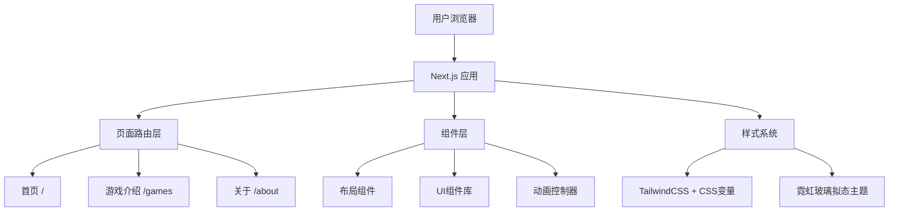

## 1. 架构设计



## 2. 技术选型

| 分类 | 技术 | 说明 |
|------|------|------|
| 框架 | Next.js 15 (App Router) | 现有项目框架 |
| 样式 | TailwindCSS + CSS自定义属性 | 实现霓虹玻璃拟态主题系统 |
| 字体 | Orbitron (标题) + Inter (正文) | Google Fonts |
| 动画 | CSS动画 + Framer Motion | 滚动触发动画、悬停效果 |
| 构建 | Vite (Next.js内置) | 现有配置 |
| 部署 | Vercel | 推荐部署平台 |

## 3. 路由定义

| 路由 | 页面 | 说明 |
|------|------|------|
| / | 首页 | 品牌形象、游戏网格、特色亮点 |
| /games | 游戏介绍页 | 九款游戏详情展示 |
| /about | 关于/下载页 | 应用信息、下载链接 |

## 4. 组件架构

### 4.1 共享组件

- **Navbar**: 顶部导航栏，含Logo和页面链接，支持移动端汉堡菜单
- **Footer**: 页脚，含版权和社交链接
- **GameCard**: 游戏卡片组件，用于首页网格展示
- **GameDetailCard**: 游戏详情卡片，用于游戏介绍页
- **FeatureCard**: 特色亮点卡片
- **NeonGlow**: 霓虹发光效果包装器
- **SectionWrapper**: 毛玻璃背景区块容器

### 4.2 页面组件

- **HomePage**: Hero区域 + 游戏网格 + 特色亮点 + 下载引导
- **GamesPage**: 分类Tab + 游戏详情卡片列表
- **AboutPage**: 应用信息 + 特色列表 + 下载区

## 5. 数据模型

### 5.1 游戏数据结构

```typescript
interface Game {
  id: string;
  name: string;
  nameEn: string;
  category: 'single' | 'board';
  description: string;
  features: string[];
  icon: string; // emoji or SVG path
  hasAI: boolean;
  difficulty?: 'easy' | 'medium' | 'hard';
}
```

### 5.2 游戏数据

```typescript
const games: Game[] = [
  // 单人游戏
  { id: 'sudoku', name: '数独', nameEn: 'Sudoku', category: 'single', description: '三种难度·笔记模式·逻辑推理', features: ['三种难度', '笔记模式', '安全保护'], icon: '🧩', hasAI: false },
  { id: 'mine', name: '扫雷', nameEn: 'Minesweeper', category: 'single', description: '经典布雷·递归展开·首次点击保护', features: ['递归展开', '安全保护', '计时挑战'], icon: '💣', hasAI: false },
  { id: 'game2048', name: '2048', nameEn: '2048', category: 'single', description: '滑动合成·冲击高分·极简规则', features: ['滑动操作', '高分挑战', '极简设计'], icon: '🔢', hasAI: false },
  { id: 'tetris', name: '俄罗斯方块', nameEn: 'Tetris', category: 'single', description: '经典下落·反应速度·空间规划', features: ['经典玩法', '速度挑战', '计分系统'], icon: '🧱', hasAI: false },
  { id: 'breakout', name: '打砖块', category: 'single', description: '十种关卡·物理碰撞·弹射反馈', features: ['十种关卡', '物理引擎', '真实弹射'], icon: '🏓', hasAI: false },
  // 棋类游戏
  { id: 'gomoku', name: '五子棋', nameEn: 'Gomoku', category: 'board', description: '双人对战·AI引擎·离线畅玩', features: ['双人对战', 'AI引擎', '离线畅玩'], icon: '⚫', hasAI: true },
  { id: 'chess', name: '国际象棋', nameEn: 'Chess', category: 'board', description: 'Alpha-Beta剪枝·三档难度·AI对战', features: ['Alpha-Beta', '三档难度', 'AI对战'], icon: '♚', hasAI: true },
  { id: 'xiangqi', name: '中国象棋', nameEn: 'Xiangqi', category: 'board', description: '经典规则·AI引擎·离线对战', features: ['经典规则', 'AI引擎', '离线对战'], icon: '🐴', hasAI: true },
  { id: 'checkers', name: '西洋跳棋', nameEn: 'Checkers', category: 'board', description: '经典跳棋·AI引擎·双人对弈', features: ['经典跳棋', 'AI引擎', '双人对弈'], icon: '🔴', hasAI: true },
];
```
